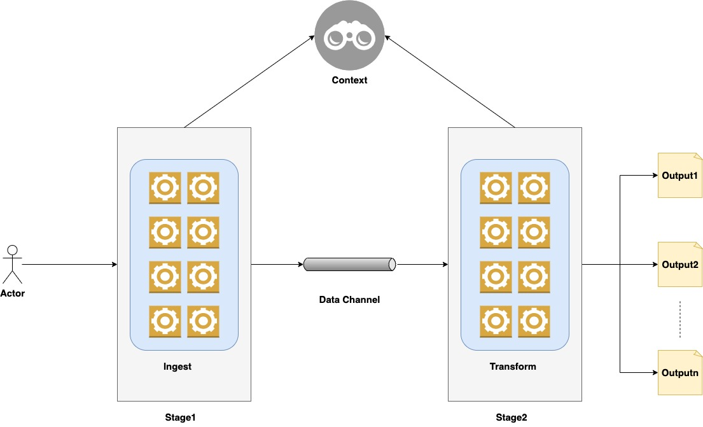
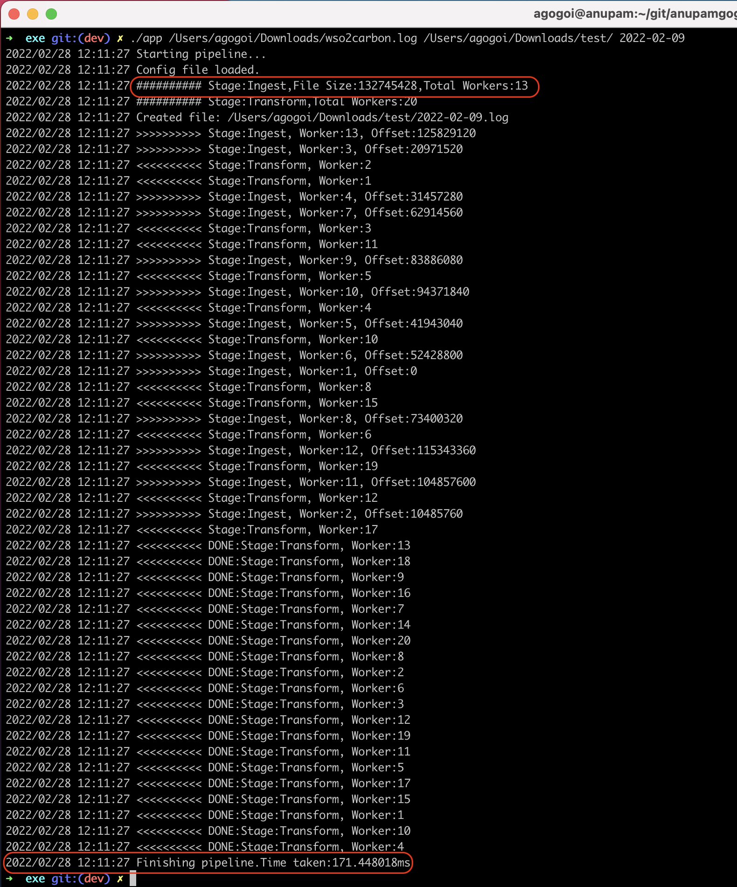

# Introduction
This is an **MVP** for a **data pipeline**. The app simply takes a file as an input and some search keywords.
Base on the search keywords, it finally creates files with the data that contains the search keywords.


# Keywords
## Stages
The pipeline has been created with **stages**. Each stage is a **data processing unit**. Normally, each stage contains **one processor** but it's
not limited to just one. More than one processor can be added to a single stage.

## Processors
**Processors** are the core part of the pipeline. The actual data processing is done by the processors. The processors can spawn multiple
**worker goroutines** to process the load concurrently.

# Architecture
.

There are two stages for this application. Both of the stages communicate between them using a **channel**.
The **Stage1** takes a file as input and its processor (**Ingest**) reads the file concurrently by spawning multiple **worker goroutines**.
The number of **goroutines** are calculated based on the size of the input file and the **size of the chunk** for reading.


The file data read by the **goroutines** are sent concurrently to the **data channel**. Now, in **Stage2**, we have another processor 
called **Transform** is running multiple **worker goroutines**. They are listening to the data in the **data channel** and concurrently processing them.
The processing logic is to **search** for some **keywords** proved to the pipeline. Based on each **keyword**
it will generate respective **file** as **output** and append data that contains the particular **keyword**.


# Configurations
In the root of the application, there is a **config.yaml** where the configurations can be provided for the pipeline.
```
stages:
  1:
    name: Ingest
    chunksizestring: 10MB
  2:
    name: Transform
    noworkers: 20
```

# Building the application.
Navigate to the **/cmd** directory of the application and execute the below command.
```
$ go build -o ../exe/app
```

It will create an executable file in the **/exe** directory. Copy the **config.yaml** to the directory and execute the below command

```
$ ./app ARG1 ARG2 ARG3 ARG4 .... ARGn
```

| ARG         | DESCRIPTION                                                            |
|-------------|------------------------------------------------------------------------|
| ARG1        | The file to process.                                                   |
| ARG2        | The target folder where the output should go.                          |
| ARG3...ARGn | The search string/s that are to be searched in the input file i.e ARG1 |

Below is an example:
```
$ /app /Users/agogoi/Downloads/wso2carbon.log /Users/agogoi/Downloads/test/ Error
```

# Load Testing.

For an input file of size **132MB** and below worker configuration the app took **171ms** to search for a keyword.
Please check the screenshot below.
```
stages:
  1:
    name: Ingest
    chunksizestring: 10MB
  2:
    name: Transform
    noworkers: 20
```

.


